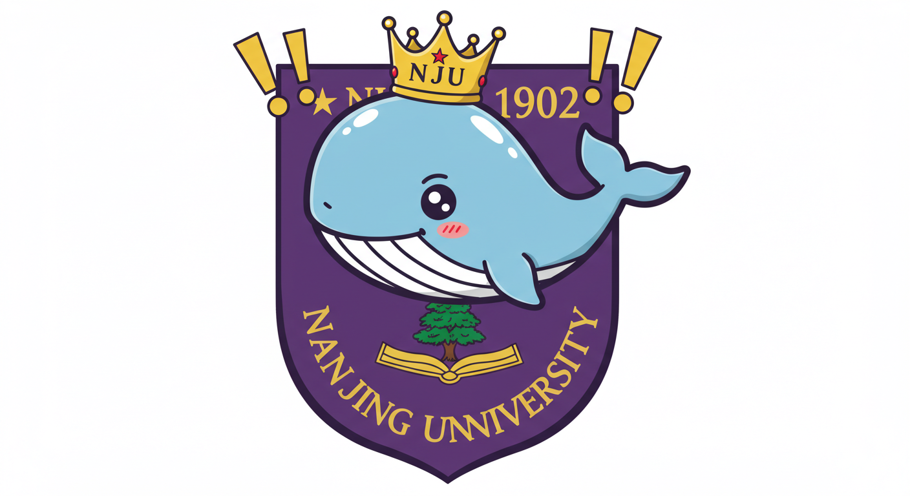

# 南京大学AI创客工坊 🚀

欢迎来到南京大学AI创客工坊！这里是一个充满创新和活力的技术社区，我们致力于探索人工智能的无限可能。



## 关于我们 🌟

让AI启发思考，而非代替思考。

本社群面向南京大学的同学，特别是对AI应用和创业感兴趣的小伙伴。尽管校内已有多个AI相关社群，我们希望聚焦于AI应用和创业这一细分领域，与志同道合的伙伴一起探索。

近年来，AI技术与各行各业的结合如火如荼，催生了众多具有潜力的初创项目。我们希望在分享这些前沿项目的同时，建立一个以AI实践为核心的社群。站在未来的角度回望，我们可能正处于AI应用和初创的黄金十年。AI不仅降低了开发门槛，提高了开发效率，还推动了创新产品的涌现。这些产品涉及情感陪伴、生产工具、效率提升等各个方面。例如，星野APP、哈工大X-GO Rider、Living AI的萌萌桌宠Aibi机器人等项目，已经成功吸引了大众关注。甚至连情人节大热的LoveKey也吸睛无数。我们在看到这些创新成果的同时，产生了想要参与其中、做点什么的冲动，因此找到了你~

我们欢迎大家在社群中自由交流，群内将不定期分享关于AI应用和创业的最新动态，包括但不限于有趣的开源项目、LLM应用、数字人等软硬件Demo，以及行业观察、创业思考、工作流搭建等内容。此外，我们还将分享南京及其他地区的AI活动信息，期待大家一起贡献、讨论和探索。

南京大学AI创客工坊是一个由热爱人工智能的学生们组成的创新社区。在这里，你可以：

- 💡 参与前沿AI项目开发
- 🤝 结识志同道合的伙伴
- 📚 获取实践学习的机会
- 🌈 实现你的创意想法

我们欢迎所有对AI技术感兴趣的同学加入，无论你是AI领域的新手还是老手，这里都有适合你的发展空间。

## 我们的优势 💪

- **专业指导**：来自南京大学AI领域的教授和专家提供指导
- **资源支持**：配备高性能计算设备和开发环境
- **项目实践**：真实项目开发经验
- **技术分享**：定期举办技术讲座和工作坊
- **创新氛围**：开放、包容、创新的团队文化

## 加入我们 🤝

- 微信公众号：扫描页面底部二维码关注(后面建立公众号后再替换)
- QQ交流群：210601357(南京大学AI创客交流群)
- 邮箱联系：[待填]

## 本地运行指南 🔧

### 环境要求

- 支持HTML5的现代浏览器
- 本地Web服务器（推荐使用Live Server）

### 运行步骤

1. **克隆项目**
   ```bash
   git clone [项目地址]
   cd AI_Website_Design
   ```

2. **使用VSCode运行（推荐）**
   - 安装VSCode编辑器
   - 安装"Live Server"扩展
   - 打开项目文件夹
   - 点击右下角"Go Live"按钮或右键index.html选择"Open with Live Server"

3. **使用Python启动本地服务器**
   ```bash
   # Python 3.x
   python -m http.server 8000
   
   # 或 Python 2.x
   python -m SimpleHTTPServer 8000
   ```
   然后在浏览器中访问 `http://localhost:8000`

4. **使用Node.js启动服务器**
   ```bash
   # 安装http-server
   npm install -g http-server
   
   # 启动服务器
   http-server
   ```
   然后在浏览器中访问显示的地址

### 目录结构

```
AI_Website_Design/
├── index.html          # 主页面
├── styles/            
│   └── main.css       # 样式文件
├── js/
│   ├── main.js        # 主要脚本
│   └── particles.js   # 粒子效果
└── images/            # 图片资源
```

## 技术栈 🛠️

- HTML5
- CSS3
- JavaScript (ES6+)
- Canvas API

## 特色功能 ✨

- 响应式设计，完美适配各种设备
- 神经网络风格的粒子动画背景
- 现代简约的UI设计
- 流畅的交互体验

## 贡献指南 🤲

我们欢迎所有形式的贡献，无论是：
- 提交新功能
- 报告问题
- 改进文档
- 分享想法

请随时提交Pull Request或Issue！

## 未来计划 🎯

- [ ] 添加更多互动功能
- [ ] 优化移动端体验
- [ ] 增加项目展示板块
- [ ] 添加在线交流功能

---

**让我们一起探索AI的无限可能！**

如果你对AI创客工坊感兴趣，欢迎随时联系我们。期待与你一起创造精彩！ 