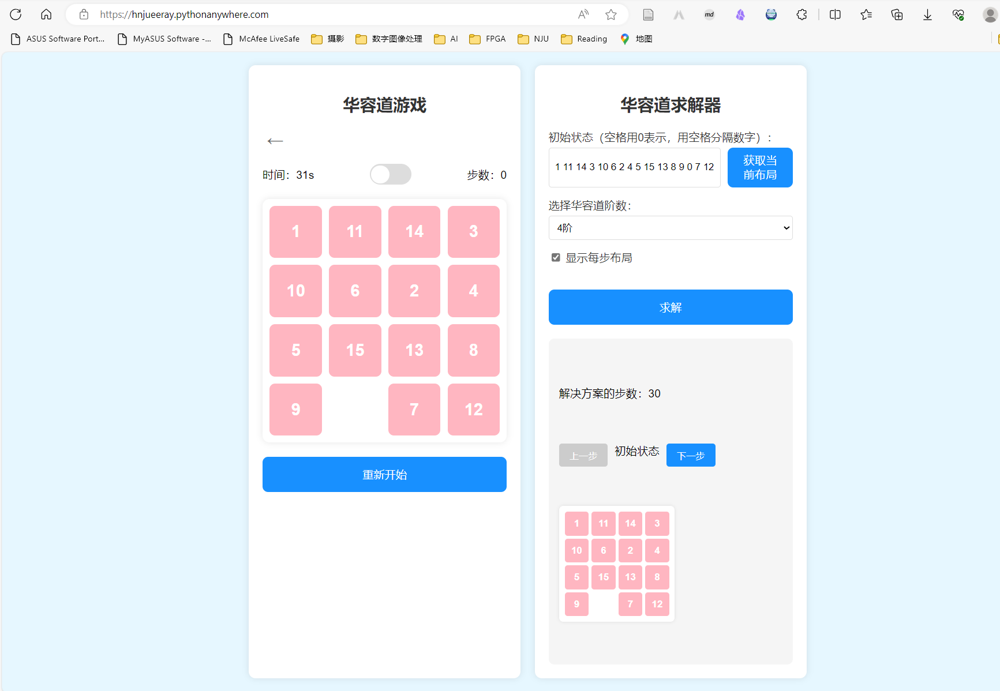
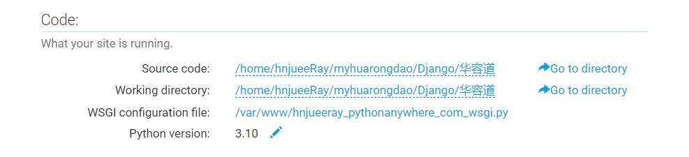
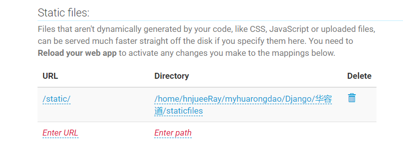

# 华容道游戏与求解器

这是一个基于Django框架开发的华容道游戏与求解器项目。项目支持3阶、4阶和5阶华容道游戏，并提供智能求解功能。

## 功能特性

1. **游戏功能**
   - 支持3阶、4阶、5阶华容道
   - 实时计时器
   - 步数统计
   - 音乐开关（预留功能）
   - 动态布局生成
   - 自动判断胜利条件

2. **求解器功能**
   - 支持任意有效布局求解
   - A*算法智能寻路
   - 曼哈顿距离启发式
   - 可显示详细解题步骤
   - 自动验证布局可解性

3. **交互特性**
   - 响应式界面设计
   - 动画效果
   - 实时布局获取
   - 步骤可视化展示

## 技术实现

### 后端实现
- **框架**: Django 5.1.6
- **核心算法**: 
  - A*搜索算法（优化版）
  - 曼哈顿距离启发式函数
  - 布局可解性判定算法

### 前端实现
- **技术栈**: 原生JavaScript + HTML5 + CSS3
- **特性**:
  - Grid布局
  - Flex布局
  - CSS3动画
  - 响应式设计

### 关键算法

1. **布局可解性判定**:
   - 奇数阶（3阶、5阶）：逆序数为偶数时可解
   - 偶数阶（4阶）：空格所在行数（从底部数）+ 逆序数为偶数时可解

2. **A*寻路算法**:
   ```python
   f(n) = g(n) + h(n)
   # g(n): 从起始状态到当前状态的实际代价
   # h(n): 从当前状态到目标状态的估计代价（曼哈顿距离）
   ```

3. **随机布局生成**:
   - 从目标状态开始
   - 执行随机有效移动
   - 自动保证可解性

## 项目结构

```
华容道/
├── funny_game/
│   ├── templates/
│   │   └── funny_game/
│   │       └── solve_puzzle.html  # 主界面模板
│   ├── views.py                   # 游戏逻辑处理
│   ├── urls.py                    # URL配置
│   ├── apps.py                    # 应用配置
│   └── __init__.py               # Python包标识
├── static/                        # 静态资源目录
├── staticfiles/                   # 收集的静态文件
├── requirements.txt               # 项目依赖
├── settings.py                    # Django配置文件
├── urls.py                        # URL路由配置
├── wsgi.py                        # WSGI服务器配置
└── manage.py                      # Django管理脚本
```

## 部署说明

1. **环境要求**:
   ```
   Python 3.10+
   Django 5.1.6
   ```

2. **安装步骤**:
   ```bash
   # 1. 创建虚拟环境
   python -m venv huarongdao-env
   
   # 2. 激活虚拟环境
   # Windows:
   huarongdao-env\Scripts\activate
   # Linux/Mac:
   source huarongdao-env/bin/activate
   
   # 3. 安装依赖
   pip install -r requirements.txt
   
   # 4. 运行部署脚本
   bash deploy.sh
   ```

3. **PythonAnywhere配置**:
   ```
   # Web应用配置
   Source code: /home/用户名/myhuarongdao/Django/华容道
   Working directory: /home/用户名/myhuarongdao/Django/华容道
   WSGI configuration file: /var/www/用户名_pythonanywhere_com_wsgi.py
   Python version: 3.10
   
   # 静态文件配置
   URL: /static/
   Directory: /home/用户名/myhuarongdao/Django/华容道/staticfiles
   ```

## 性能优化

1. **算法优化**:
   - 使用优先队列优化A*搜索
   - 优化曼哈顿距离计算
   - 智能超时处理

2. **前端优化**:
   - 最小化DOM操作
   - 使用事件委托
   - CSS3硬件加速

## 测试记录

### 2025-02-24 部署测试
- **环境**: PythonAnywhere
- **Python版本**: 3.10.5
- **Django版本**: 5.1.6
- **测试项目**:
  1. 静态文件服务 ✓
  2. 游戏界面加载 ✓
  3. 布局生成功能 ✓
  4. 求解器功能 ✓
  5. 数据库连接 ✓
- **性能测试**:
  - 3阶华容道求解: < 1秒 ✓
  - 4阶华容道求解: < 10秒 ✓
  - 5阶华容道求解: < 30秒 ✓
- **结论**: 所有功能测试通过，性能符合预期

## 注意事项

1. 在生产环境部署时：
   - 修改`settings.py`中的`DEBUG`为`False`
   - 配置正确的`ALLOWED_HOSTS`
   - 使用安全的`SECRET_KEY`
   - 确保静态文件正确收集

2. 性能考虑：
   - 3阶和4阶华容道通常能快速求解
   - 5阶华容道可能需要较长时间
   - 设置了合理的求解超时限制

## 后续优化方向

1. 功能扩展：
   - 添加音效支持
   - 增加难度等级
   - 添加历史记录
   - 实现排行榜

2. 性能优化：
   - 使用WebSocket实现实时求解
   - 优化A*算法性能
   - 添加缓存机制

3. 用户体验：
   - 添加操作教程
   - 优化移动端适配
   - 增加主题切换
   - 添加分享功能

## 贡献指南

欢迎提交Issue和Pull Request来帮助改进项目。在提交代码前，请确保：

1. 代码符合Python PEP8规范
2. 添加必要的注释和文档
3. 确保所有测试通过
4. 提供清晰的提交信息

## 许可证

本项目采用MIT许可证。详见LICENSE文件。

## 更新日志

### 2025-02-24
- 完成项目部署配置优化
- 修复相对导入问题
- 优化静态文件处理
- 所有功能测试通过 

### 2025-02-23
- 优化A*算法性能
- 修复布局可解性判断
- 改进随机布局生成
- 添加超时处理机制

---

# 华容道游戏与求解器部署指南
> create by njueeRay : 2025-02-23

## PythonAnywhere 部署步骤

### 1. 准备工作
已有文件：
```bash
requirements.txt    # 项目依赖
wsgi.py            # WSGI配置
settings.py        # Django设置
```

### 2. 项目路径配置



```bash
# 源代码路径
Source code: /home/hnjueeRay/myhuarongdao/Django/华容道

# 工作目录
Working directory: /home/hnjueeRay/myhuarongdao/Django/华容道

# WSGI配置文件
WSGI configuration file: /var/www/hnjueeray_pythonanywhere_com_wsgi.py

# Python版本
Python version: 3.10
```

### 3. 虚拟环境配置
```bash
# 创建虚拟环境
mkvirtualenv --python=/usr/bin/python3.10 huarongdao-env

# 安装依赖
cd /home/hnjueeRay/myhuarongdao/Django/华容道
pip install -r requirements.txt
```

### 4. WSGI 配置
在 `/var/www/hnjueeray_pythonanywhere_com_wsgi.py` 中添加：
```python
import os
import sys

# 设置项目路径
path = '/home/hnjueeRay/myhuarongdao/Django/华容道'
if path not in sys.path:
    sys.path.append(path)

# 设置Django设置模块
os.environ['DJANGO_SETTINGS_MODULE'] = 'settings'

# 获取WSGI应用
from django.core.wsgi import get_wsgi_application
application = get_wsgi_application()
```

### 5. 静态文件配置



1. **创建静态文件目录**：
```bash
mkdir -p /home/hnjueeRay/myhuarongdao/Django/华容道/static
```

2. **Web配置页面设置**：
```
Static files:
URL: /static/
Directory: /home/hnjueeRay/myhuarongdao/Django/华容道/static
```

3. **收集静态文件**：
```bash
cd /home/hnjueeRay/myhuarongdao/Django/华容道
python manage.py collectstatic --noinput
```

### 6. Django设置修改
在 `settings.py` 中更新：
```python
ALLOWED_HOSTS = ['hnjueeray.pythonanywhere.com']
DEBUG = False  # 生产环境关闭调试
STATIC_URL = '/static/'
STATIC_ROOT = os.path.join(BASE_DIR, 'static')
```

### 7. 重新加载应用
- 在Web配置页面点击 "Reload" 按钮
- 访问 `https://hnjueeray.pythonanywhere.com`

## 故障排除

### 1. 500错误检查
- 查看 `/var/log/hnjueeray.pythonanywhere.com.error.log`
- 检查WSGI配置路径
- 验证虚拟环境配置

### 2. 静态文件问题
- 确认目录权限：
```bash
chmod -R 755 /home/hnjueeRay/myhuarongdao/Django/华容道/static
```
- 验证静态文件是否正确收集
- 检查URL配置

### 3. 应用功能异常
- 检查浏览器控制台
- 验证API响应
- 查看Django日志

## 维护说明

### 1. 定期维护
- 每3个月登录续期
- 检查日志文件
- 更新依赖包

### 2. 性能监控
- 监控CPU使用情况
- 检查响应时间
- 观察错误日志

### 3. 安全建议
- 定期更新 `SECRET_KEY`
- 保持依赖包最新
- 监控异常访问

## 技术支持
如遇问题：
1. 查看 DEBUG_LOG.md
2. 检查错误日志
3. 提交Issue反馈